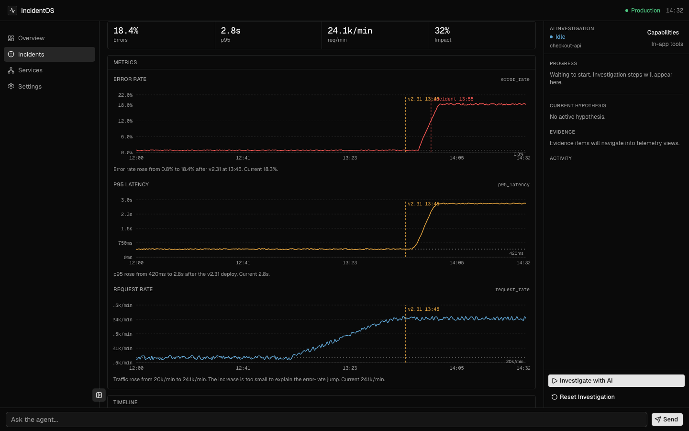
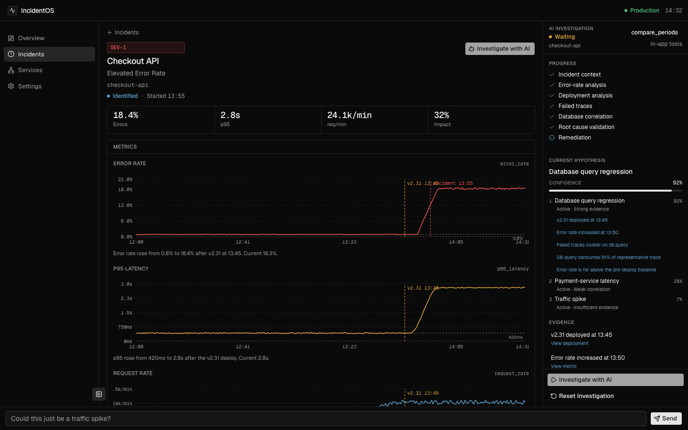
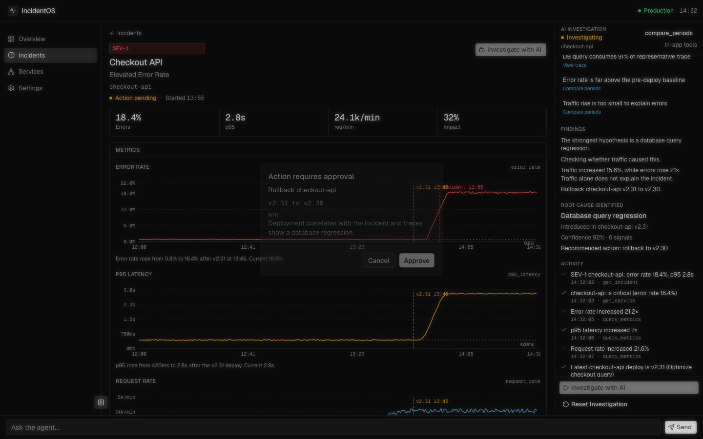

# IncidentOS

Agent-native observability workspace. The **page** exposes domain tools on `document.modelContext` (`get_investigation_context`, `query_metrics`, `search_traces`, `propose_rollback`, `rollback_deployment`, …). A human and an agent investigate a production incident together. Mutations require human approval.

This is not a chatbot beside dashboards.

**Live demo:** [https://yunus-incidentos.vercel.app](https://yunus-incidentos.vercel.app)

## Judge path (WebMCP / site tools)

Judges should use **ChatGPT’s desktop built-in browser** ([site tools](https://learn.chatgpt.com/docs/webmcp)). That is ChatGPT’s WebMCP implementation.

- Model: **GPT-5.6 Sol** or **GPT-5.6 Terra**. GPT-5.6 Luna has site tools disabled.
- Settings → Browser → Permissions → **Enable site tools**.
- Not available in Enterprise or Edu workspaces.
- Stay on the incident page. Tools belong to that page; navigating away unregisters them.
- Address bar → **Site tools** → **Available site tools** (12 tools: 9 read, 3 write). Start with `get_investigation_context`.
- Read-only tools never trigger a write. Prefer site tools over clicking the dashboards. Each tool call scrolls and highlights the matching telemetry.

Alternatively: **Chrome 149+** with `chrome://flags/#enable-webmcp-testing`.

1. Open [checkout-api SEV-1](https://yunus-incidentos.vercel.app/incidents/checkout-api-error-rate).
2. Confirm the incident in ~10 seconds: **18.4%** error rate, **2.8s** p95, deploy **v2.31** at 13:45.
3. Ask ChatGPT Work or Codex to investigate `checkout-api-error-rate` using the page tools. Watch Activity fill as tools run.
4. When it calls `propose_rollback`, **Approve** in the dialog. That tool waits for the click, then it should call `rollback_deployment`. Charts recover toward **1.1% / 430ms**.
5. **Reset Investigation** to replay.

ChatGPT reviews each tool call before the page runs it. IncidentOS still requires a human **Approve** before `rollback_deployment` mutates telemetry.

### In-app fallback (no WebMCP)

If `typeof document.modelContext?.registerTool !== "function"`, the header shows **WebMCP unavailable · in-app demo**. Click **Investigate with AI** and follow the scripted 60–90s path. This is a backup, not the judged WebMCP demonstration.

1. Watch real tool calls (same execute functions as WebMCP): incident, service, metrics including db_latency, deployments, traces, logs, compare, then payment-service as a negative check.
2. Click evidence items to jump into traces / logs / deployments.
3. Click **Could this just be a traffic spike?**
4. After the note and **propose_rollback**, Approve **v2.31 → v2.30**. Reset to replay.

SEV-2 / SEV-3 pages are context only. The scripted investigation is the checkout-api SEV-1.







## Demo story

SEV-1 on `checkout-api`: elevated error rate after `v2.31` (“Optimize checkout query”). Root cause is a database query regression. Traffic only rises ~20k → 24.1k/min, which does not explain a ~23× error-rate jump.

## Run locally

```bash
pnpm install
pnpm dev
```

Open [http://localhost:3000](http://localhost:3000). Use ChatGPT’s desktop browser (Sol/Terra) or Chrome with the WebMCP flag for the primary path; the in-app demo needs no API key.

Optional real LLM follow-ups:

```bash
cp .env.example .env.local
# AI_GATEWAY_API_KEY=
# LLM_MODEL=anthropic/claude-sonnet-4.6
# NEXT_PUBLIC_FORCE_DEMO=0   # allow LLM even on a production build
```

Never put keys in client code. Production stays on the deterministic in-app demo unless you override that flag; WebMCP registration is independent of the LLM.

## Scripts

```bash
pnpm dev
pnpm test
pnpm lint
pnpm build
```

## Architecture

See `docs/ARCHITECTURE.md`. Tools share one execute path for:

- Browser `document.modelContext.registerTool` (WebMCP)
- In-app deterministic demo
- Optional in-app LLM follow-ups

## Stack

Next.js 16 App Router, React 19, Tailwind v4, shadcn/ui, Zustand, Zod, AI SDK, Recharts.

## License

MIT. See [LICENSE](LICENSE).
